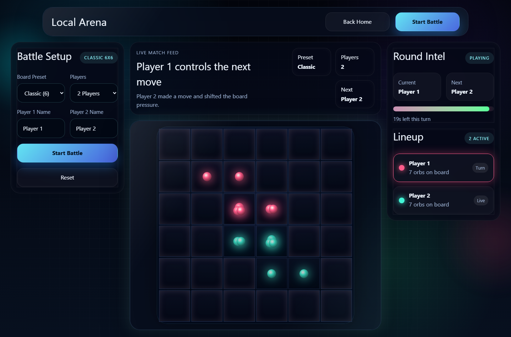
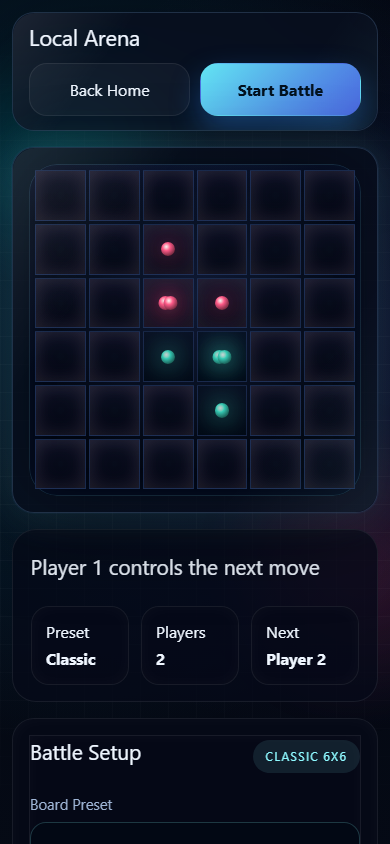

# Chain Reaction Global

A glow-styled take on Chain Reaction, built with Next.js and TypeScript.

Place an orb on an empty cell or one you already own. When a cell reaches its
critical mass — 2 at a corner, 3 on an edge, 4 in the interior — it explodes into
its orthogonal neighbours, converting them to your colour. Explosions cascade.
Last player standing wins.

## Status

| Mode | State |
|---|---|
| `/` — mode select | Working |
| `/local` — 2–8 players on one device | Working |
| `/multiplayer` — cross-device rooms | **Not implemented.** Placeholder page only. |

Local mode supports five board presets (6×6 up to 14×14), 2–8 players, a
20-second turn timer, and a random valid auto-move when the timer runs out.

Multiplayer has not been started. There is no socket server, no room flow and no
realtime dependency in the project. The transport has been chosen — PartyKit,
deployed to a Cloudflare account — but no code exists yet.

## Running it

```bash
npm install
npm run dev          # http://localhost:3000
```

## Development

```bash
npm run lint         # ESLint 9, flat config
npm run typecheck    # tsc --noEmit
npm test             # Vitest — engine unit tests
npm run build        # production build
npm run test:e2e     # Playwright, needs a build first
```

CI runs all of these on every push and pull request.

## Architecture

The game rules live in `lib/engine/` as pure functions — no React, no DOM, no
timers, no randomness. ESLint enforces that boundary. The same engine is intended
to run in the browser, in tests, and later inside an authoritative multiplayer
server, so it must stay free of anything that only exists in one of them.

`components/` holds presentation only. Any change to a gameplay rule needs a test
in the same pull request.

See [CLAUDE.md](CLAUDE.md) for conventions and [docs/](docs/) for the product
spec, architecture reference and roadmap.

## Screenshots

Local arena mid-match, 6×6 Classic:



Board-first on a phone — the grid is reachable without scrolling:



Regenerate with:

```bash
npm run build
npx next start --port 3200 &
node scripts/capture-screenshots.mjs
```
